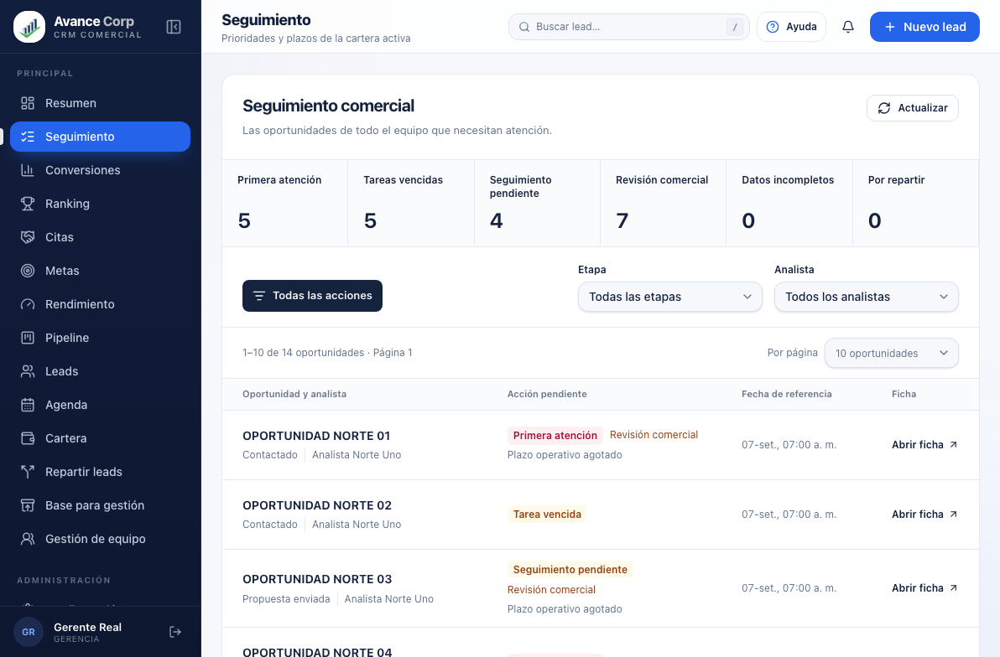
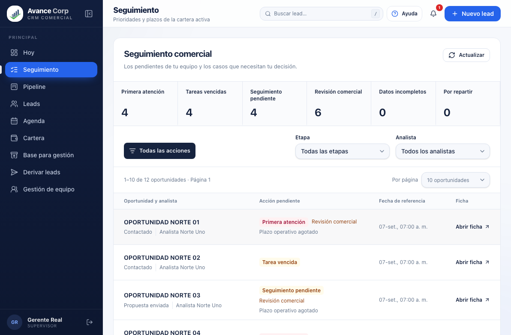
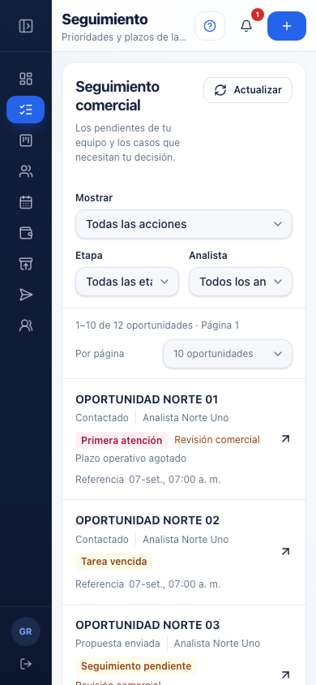

# Seguimiento como módulo propio

Estado al 07/09/2026 UTC: **PUBLICADO** en `crm.miavance.com`, con verificación HTTP y de interfaz en sesión real de Gerencia correctas. Commit de implementación: `311a212ea9330511fb861c12e07d45801ccd4758`; fuente del artefacto publicado: `556133fdedf5983a4a3a5e221c1296039681b731`. La publicación del núcleo SLA sigue documentada en [PUBLICACION-SLA-2026-09-07.md](PUBLICACION-SLA-2026-09-07.md).

Miguel pidió mejorar visualmente Seguimiento, conocer la vista de Supervisor y separarlo del Resumen de Gerencia. Después autorizó guardar los cambios en commits y publicar el módulo.

## Decisión y alcance

La ruta `#/seguimiento` tiene una entrada «Seguimiento» en el menú para Gerencia, Supervisor y Analista. Reutiliza el núcleo SLA y las RPC vigentes; no introduce calculadoras, políticas, tablas ni migraciones. Muestra la situación actual de la cartera, independiente del período y origen elegidos para los resultados de Gerencia.

| Rol | Nueva experiencia | Alcance de datos |
|---|---|---|
| Gerencia | La cola sale completamente de Resumen y se abre desde Seguimiento. | Cartera global autorizada. |
| Supervisor | El módulo ocupa su pantalla propia; Hoy conserva Agenda y un acceso «Abrir seguimiento». | Su equipo y descendencia recursiva autorizada por el servidor. |
| Analista | Puede entrar al módulo y conserva la cola de trabajo en Hoy. | Solo su cartera. |

Se conserva el cierre general del mundo Leads. Directorio, Coordinador y Superadmin que solo administra roles no ganan acceso a esta vista. El modo legado y los errores del núcleo siguen teniendo estados explícitos; no se inventa una cola operativa con datos de demo.

## Revisión visual y cambios

1. **Resumen anterior, capturado en producción:** la cola ocupaba el espacio anterior a los indicadores y aparecía bajo filtros de período/origen que no la controlaban. La captura privada de esta revisión se guardó fuera del repositorio porque contiene datos reales. La vista anterior del Supervisor se comprobó en código; no se inició sesión con una cuenta real de Supervisor.
2. **Módulo en escritorio:** prioridades seleccionables con conteos del servidor, filtros por etapa y analista, columnas de oportunidad/responsable, acción, fecha y apertura de ficha. Los colores distinguen la acción y el texto conserva su significado. El botón «Limpiar filtros» restablece la consulta sin alterar el tamaño de página.
3. **Módulo en móvil:** las prioridades pasan a un selector nativo, las filas se reorganizan y el título permanece completo. Se corrigió la alineación de «Por página» y su flecha. Las capturas siguientes utilizan datos sintéticos.

El filtro Analista ahora ofrece únicamente vendedores activos del roster autorizado. Antes incluía gerentes y supervisores, aunque la consulta filtra por analista asignado. Los conteos de señales pueden solaparse; no se suman ni se presentan como total de oportunidades. El total de la lista procede de la respuesta del servidor.

Se conserva la paginación 10/25/50 con Anterior/Siguiente, sin acumular filas, y el reinicio del cursor al filtrar o invalidar. Se conservan la apertura de fichas fuera de la carga inicial, sus controles de acceso y los estados de carga/error. Las acciones comerciales continúan dentro de la ficha.

## Evidencia

- Suite completa: 2939 pruebas en 202 archivos; controles de tipos correctos y lint sin errores, con cuatro avisos preexistentes de otro componente.
- E2E SLA: 9/9 casos. Incluyen navegación, ámbito global/equipo simulado, filtros combinados, conteos solapados, páginas y fichas. Los dos casos de Gerencia/Supervisor se repitieron después del ajuste visual final: 2/2, sin desbordamiento ni errores de página; título móvil medido con `scrollWidth <= clientWidth`.
- Las pruebas E2E usan backend simulado para comprobar la interfaz. No sustituyen las pruebas RLS/SQL de la publicación del núcleo ni equivalen a una sesión real de Supervisor.
- [Registro de comprobación y huellas de capturas](modulo-seguimiento-20260907/verificacion.json).

## Publicación confirmada

El artefacto se construyó desde una fuente limpia y se publicó después de sincronizar Main con `avancecorp/main`.

| Dato | Valor |
|---|---|
| Fuente publicada | `556133fdedf5983a4a3a5e221c1296039681b731` |
| Build | `build-20260907T054758176Z` |
| Release | `crm-20260907T055007Z-556133fdedf5` |
| ZIP | 1.920.456 bytes; 78 archivos |
| SHA-256 del ZIP | `c9d6abee25ea175e865c9fa14283073fb81b0f85dc78cdceb0d935c5c9340988` |

La [verificación HTTP de producción](modulo-seguimiento-20260907/produccion-http.json), realizada del `2026-09-07T05:52:56.534Z` al `2026-09-07T05:53:00.277Z`, confirmó versión estable y cero fallos: 65 archivos con hash exacto, 12 imágenes transformadas por Hostinger y `.htaccess` protegido con 403. Las URLs públicas del ZIP devolvieron 404 tanto en CRM como en el portal. La evidencia conserva íntegro el resultado sin datos de clientes; las imágenes optimizadas no se presentan como copias binarias idénticas.

La [verificación de interfaz en producción](modulo-seguimiento-20260907/produccion-ui.json) se realizó en Chrome con la sesión real de Gerencia y el build indicado. Tras actualizar mediante el aviso de nueva versión, se confirmó una entrada Seguimiento en el menú y ninguna cola en Resumen. El módulo mostró 815 oportunidades, 10 filas por página y el rango 11–20 de 815 al avanzar. Contactado reinició la página y mostró 408 resultados; al añadir un analista autorizado quedaron 25; al añadir Revisión comercial quedaron 19, con 10 filas y los tres filtros respetados.

La ficha abrió correctamente y mostró la sección Seguimiento; se cerró sin guardar cambios. Limpiar filtros recuperó 815 oportunidades; el tamaño 25 mostró 25 filas. La comprobación terminó con todos los filtros generales y tamaño 10 restaurados, sin errores de consola. Estos conteos corresponden a esa lectura y no fijan una población permanente. La captura real permanece privada, fuera del repositorio. No se inició una sesión real de Supervisor: su verificación sigue siendo la E2E con datos sintéticos descrita arriba.

### Gerencia, escritorio

### Supervisor, escritorio

### Supervisor, móvil

La tipografía, el navy institucional, los controles y el menú parten del diseño existente. Las capturas permiten evaluar composición y legibilidad; no constituyen una certificación completa de accesibilidad. Los commits documentales posteriores conservan la evidencia y no cambian la fuente ni el build del artefacto servido.
