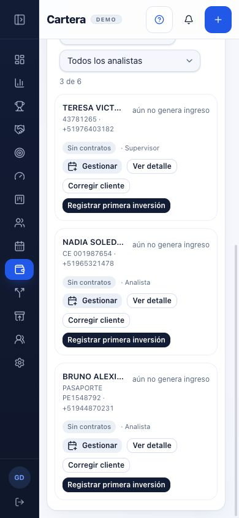
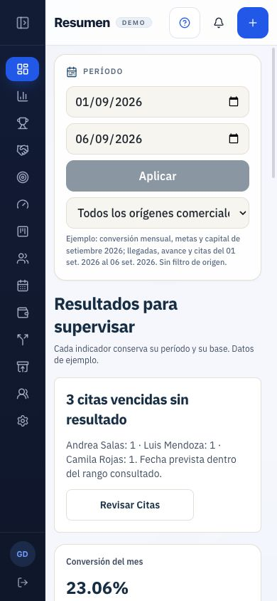

# F0 — Continuación: reutilización y navegación móvil

Fecha: 6 de septiembre de 2026. CRM local, Gerencia demo, Chrome. Implementación pausada.

## Resultado

Se vinculó la mejora de diez áreas con componentes y librerías ya existentes. [Inventario de reutilización](inventario-reutilizacion.md) · [Figma editable](https://www.figma.com/design/1FEvjQkwSzNDsGJ7UUvqIK?node-id=138-2).

Se comprobó el regreso Cartera → Resumen dos veces, con y sin búsqueda, manteniendo 390 × 844. Ambos regresos terminaron al inicio. El riesgo anterior de desplazamiento heredado no se reprodujo; no hubo una corrección ni se descarta el escenario anterior que incluía cambio de tamaño.

## Recorrido documentado

| Paso | Pantalla / acción | Estado |
| --- | --- | --- |
| 1 | Resumen inicial en móvil, desplazamiento 0 | Accesible; la jerarquía visual conserva los problemas ya registrados en UX0-01. |
| 2 | Cartera desplazada, lista sin búsqueda, antes de regresar | Consulta operable; persisten densidad y nombres abreviados de UX0-07. |
| 3 | Regreso a Resumen | Correcto para esta comprobación: desplazamiento 0. |

### 1. Resumen inicial

La pantalla es el CRM actual. La propuesta elegida por Miguel sigue siendo el nodo Figma 112:14. La fecha de esta demo es del 1 al 6 de septiembre; las capturas anteriores se conservan como antecedente del día 5.

### 2. Cartera desplazada

En la segunda repetición se verificó un desplazamiento estable de 579 px antes de regresar. No se enviaron formularios ni se modificaron fichas. En la primera repetición se buscó NADIA; al salir y entrar de nuevo la búsqueda quedó vacía. La conservación previamente verificada al cerrar la ficha no implica conservar la búsqueda al cambiar de módulo.

### 3. Regreso a Resumen

Ambos regresos terminaron en 0. Las capturas aceptadas de inicio y segundo regreso tienen el mismo contenido de imagen en Figma. Se preservan los datos, filtros y comportamiento actual; esta comprobación no mide tiempo ni éxito humano.

[Las tres capturas y notas están en Figma](https://www.figma.com/design/1FEvjQkwSzNDsGJ7UUvqIK?node-id=138-52).

## Evidencia y límites

- [Mediciones de navegación](mediciones-navegacion.json): las lecturas inmediatamente posteriores al gesto de scroll pueden ser transitorias. Se distinguió la medición estable de 579 px; no usar 92/124 px como desplazamientos finales.
- Las capturas 02 y 03 son auxiliares del primer recorrido. Las tres anteriores forman la secuencia representativa aceptada y colocada en Figma.
- Emulación de tamaño; no teléfono físico, teclado virtual ni lector de pantalla. No prueba integral de accesibilidad.
- Los nueve hallazgos iniciales se conservan. UX0-06 (foco al cerrar la ficha de Cartera) no se dio por corregido por usar Radix ni se volvió a probar en esta continuación.
- No se instalaron dependencias ni se ejecutaron pruebas de compilación por esta auditoría documental. [Control de fuente](verificacion-fuente.json): 462 archivos de frontend, ninguno cambiado, añadido o eliminado. Tampoco hay diferencia frente al inicio de F0 original.
- El inventario Figma tiene diez filas sin desbordamientos; las tres imágenes están en sus nodos, a 390 × 844, con FIT y dentro de la sección. Se inspeccionaron visualmente ambos tableros después de colocarlas.

## Pendiente para cerrar F0

Confirmar las prioridades/frecuencias reales y observar una persona realizando las tareas. Se presentó a Miguel una tarea de lectura/comparación desde Resumen local; aún no hay respuesta registrada. Un autoinforme posterior debe identificarse como tal y no convertirse en observación, tiempo o número de clics medidos.

Se dejó la demo local en Resumen, con tamaño normal y menú abierto, lista para continuar. El diseño y la implementación siguen el plan principal y la regla expresa de aprovechar el CRM existente.
