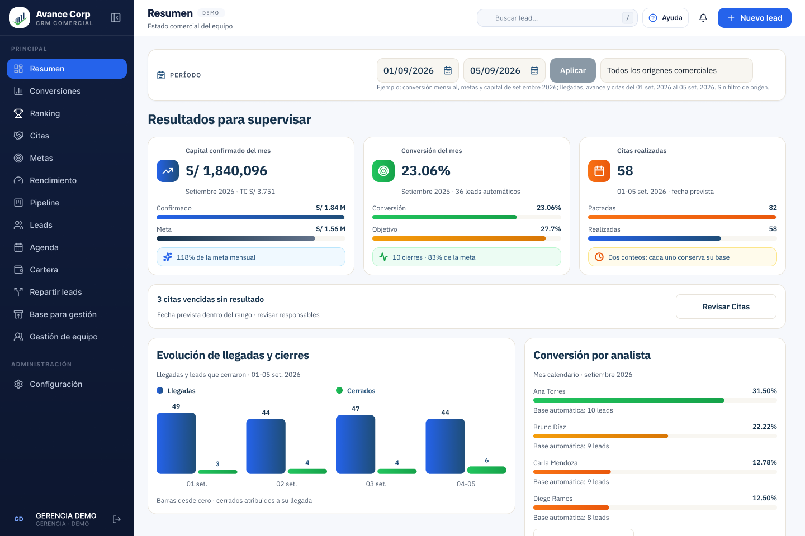
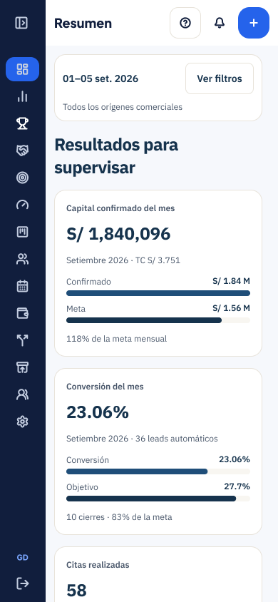

# Revisión de la propuesta con color

6 de septiembre de 2026. Miguel está mejorando el diseño con el agente de Figma y pidió revisar esa propuesta como referencia: más color y recursos visuales que ayuden a entender la información. Esta revisión fue sólo de lectura; no se editaron Figma ni el frontend.

Fuente principal: [Propuesta UI-UX (2) · Resumen / desktop, 112:14](https://www.figma.com/design/1FEvjQkwSzNDsGJ7UUvqIK?node-id=112-14). La selección abierta por Miguel, `112:176`, corresponde al área de trabajo dentro de esa pantalla. Capturas nuevas obtenidas mediante Figma MCP; no se usaron capturas anteriores para describir su estado actual.

## 1. Resumen escritorio — dirección visual útil, semántica de color por afinar

**Qué funciona.** Los iconos ayudan a distinguir capital, conversión y citas. Las etiquetas de avance tienen fondos suaves y se encuentran con facilidad. Llegadas y cierres incorporan colores y leyenda; las cifras siguen visibles. Se conserva la marca, navegación y estructura que Miguel ya eligió.

**Qué ajustar antes de extenderlo.** El verde de conversión puede sugerir que se logró el objetivo, aunque 23.06 % frente a 27.7 % representa el 83 % del objetivo. Definir si el color identifica una categoría o comunica cumplimiento. Los colores verde/ámbar/naranja de los analistas también requieren una regla visible y una referencia comparable; no inferir umbrales de rendimiento por su posición en la lista. Mantener valores y etiquetas para que el color no sea la única explicación.

El contexto del período sigue ocupando una línea larga de texto pequeño. Conviene mantener visible lo indispensable y reservar la explicación completa para el detalle. Conservar las definiciones actuales: mes y rango siguen siendo consultas diferentes.

## 2. Resumen móvil — adaptación de color todavía pendiente en la vista comprobada

La vista `113:55` aún presenta las barras navy/azul anteriores y el encabezado grande «Resultados para supervisar». La actualización cromática observada en escritorio todavía no aparece en esta captura móvil. La composición compacta preparada en UX2 (`162:718`) sigue siendo aprovechable; al continuar el diseño, combinar esa jerarquía con el lenguaje visual actual de Miguel.

## Movimiento y comportamiento propuestos

GSAP ya está integrado en [GerenciaMotion](../../../CRM-Avance-Corp/app/src/components/gerencia/motion.tsx): anima la entrada de controles, indicadores y paneles, limita su alcance al componente y omite el movimiento cuando está solicitada la preferencia reducida. La documentación actual de [GSAP para React](https://github.com/greensock/react) confirma el patrón de alcance y limpieza al cambiar dependencias utilizado por el CRM.

La siguiente especificación debe relacionar cada movimiento con una tarea:

| Acción | Respuesta visual prevista |
| --- | --- |
| Aplicar un filtro compatible | Mostrar actualización y cambiar sólo los gráficos que dependen de esa consulta; conservar etiquetas de período/base. |
| Seleccionar o comparar un analista | Destacar la selección y abrir la comparación conservando su contexto. |
| Abrir detalle o filtros | Transición breve del panel, con controles utilizables y regreso claro. |
| Llegar un resultado actualizado | Señalar el dato que cambió; mostrar de inmediato su cifra verdadera, sin usar cero como estado de carga. |

Son criterios de diseño para el frontend, no comportamiento nuevo implementado. Las animaciones propias de los gráficos y las transiciones de contenedores deben coordinarse para evitar animar dos veces el mismo elemento. No se requieren backend, permisos ni fórmulas nuevos.

## Límites y continuidad

Se inspeccionaron dos pantallas y sus etiquetas; no se ejecutó una prueba de interacción ni de movimiento en esta revisión. Una captura Figma no acredita rendimiento, teclado, foco, lectores de pantalla, contraste completo ni animaciones de GSAP funcionando. La adaptación móvil y la regla de colores siguen pendientes. El agente de Figma puede continuar editando; estas conclusiones corresponden al momento capturado.

La referencia cromática vigente pasa a ser la propuesta de escritorio que Miguel está afinando. Las variantes, composición móvil y recorridos del bloque UX1/UX2 anterior se conservan como trabajo reutilizable. El siguiente paso es concretar color, estados e interacciones sobre esa referencia dentro de UX2/UX4/UX5; la revisión prevista precede a la implementación. F0 conserva su validación humana pendiente.

[Lectura de etiquetas y colores](lectura-color.json) · [Plan maestro](../../01-plan/PLAN-MAESTRO.md) · [Entrega UX1/UX2 anterior](../../04-propuestas/revision-ux1-ux2-2026-09-06/README.md).
