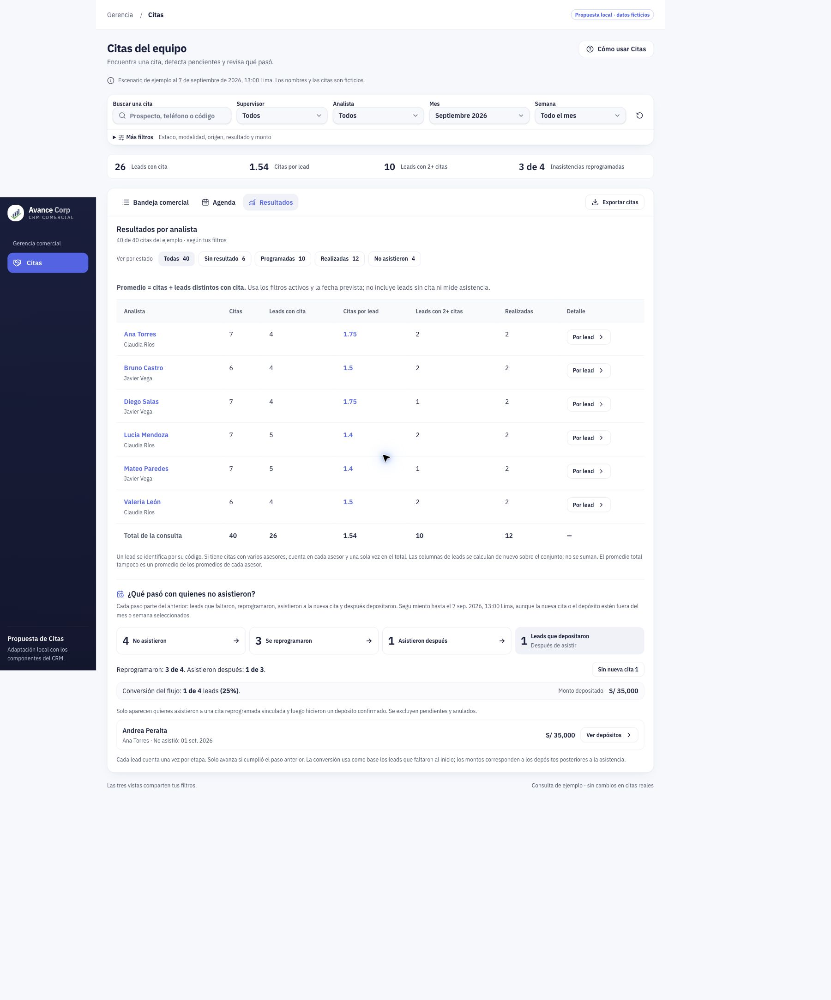
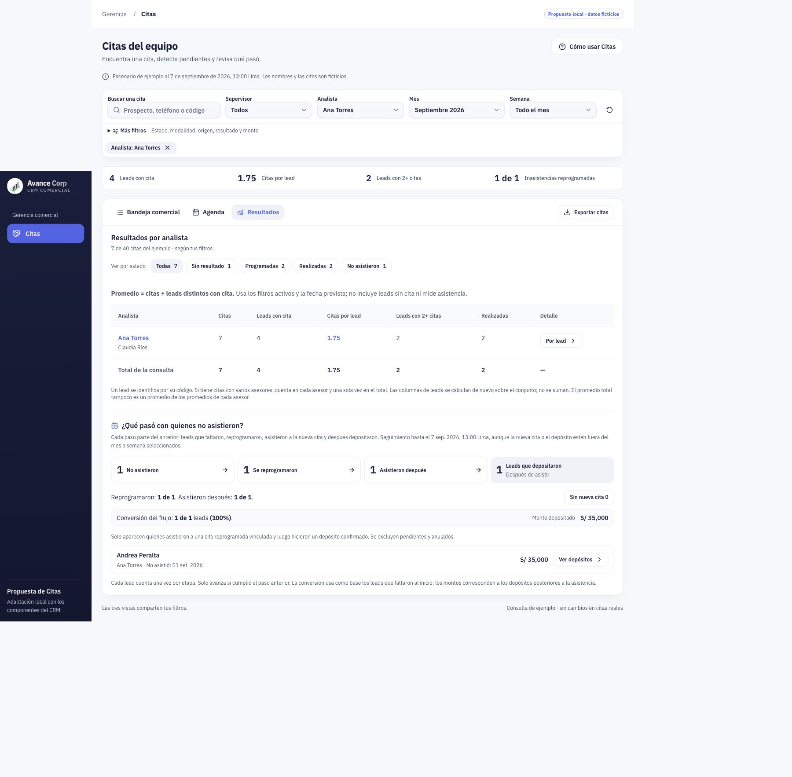
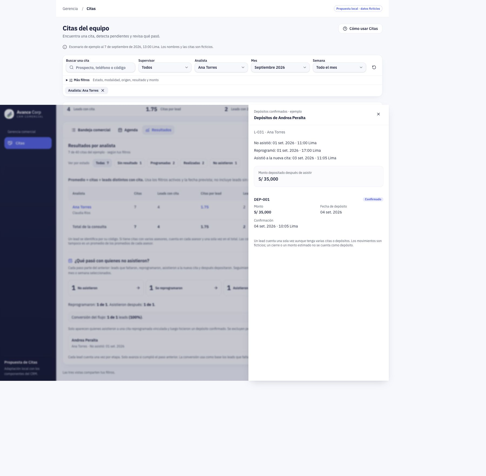

# Citas: entender el resultado y llegar al caso

Propuesta de experiencia del 8 de septiembre de 2026. Dirigida al usuario de Gerencia del CRM. Estado: propuesta visual, pendiente de elección; no modifica la implementación ni las fórmulas. El ejemplo conserva su corte ficticio del 7 de septiembre de 2026 a las 13:00 Lima.

## Criterio recomendado

**Prioridad explícita posterior de Miguel:** hacer muy claro qué pasó con quienes no asistieron, con una composición horizontal de una sola pasada, al estilo de un tablero Power BI, y con los filtros aplicados. El concepto recomendado es una matriz por persona, con etapas alineadas de izquierda a derecha; no una página larga de tarjetas apiladas. Escritorio objetivo: 1920 × 1080; adaptación de escritorio a 1440 × 900 conservando columnas esenciales.

Aplicar **número → lista → ficha**. En Resultados, mostrar primero la recuperación de inasistencias y la conversión a depósito; mantener cerca la comparación de asesores. Cada cifra abre las personas o citas que la explican y la ficha conserva el contexto de regreso. La matriz usa columnas Prospecto / No asistió / Reprogramación / Asistencia / Depósito del flujo. Un «—» en depósito significa que no completa este flujo, no que se afirme ausencia de cualquier movimiento del lead.

La reducción de espacio viene de agrupar, alinear y retirar repeticiones. No consiste en encoger el texto ni eliminar campos.

Principios del proyecto: [Fundamentos UX del CRM](../../../BASE%20DE%20CONOCIMINETO/AVANCECORP/Fundamentos%20UX%20del%20CRM.md) y [Plan UX número–lista–ficha](../../../BASE%20DE%20CONOCIMINETO/AVANCECORP/Plan%20UX%20Gerencia%20-%20numero%20lista%20ficha%202026-09-06.md). Se conserva IBM Plex Sans en reportes, navy institucional, azul para acciones, el resto del color con significado y los controles existentes del CRM. Se aplica la regla de Tesler: el sistema calcula; el usuario interpreta una base explícita y decide.

## Revisión de la experiencia actual

Capturas de esta revisión en Chrome, sobre el prototipo local con datos ficticios, a 1440 × 1024 px CSS. Las capturas de página completa incluyen posiciones del sidebar y de la ficha fija correspondientes al desplazamiento; esas posiciones no se consideran defectos de diseño.

1. **Leer resultados — funcional, jerarquía mejorable.** Se conservan filtros y acceso a registros. El flujo comienza a unos 1253 px desde el inicio del documento, después de la tabla de seis asesores, fuera de la primera pantalla de 1024 px. Su importancia comercial queda detrás de la comparación. Las instrucciones largas y varias franjas aumentan el recorrido visual. Se propone subirlo, agrupar las bases con sus números y dejar la explicación extensa en «Cómo se calcula».

2. **Filtrar por asesora — buen contexto, repetición mejorable.** Ana aparece seleccionada y en una etiqueta removible. Los datos cambian coherentemente a 7 citas, 4 leads y 1.75 citas por lead; el flujo a 1 → 1 → 1 → 1. La fila de Ana y el total muestran las mismas cifras cuando solo queda una persona. Se propone resumir ese caso sin duplicar filas, conservando el denominador visible y la distinción entre la consulta total y la selección de detalle.

3. **Abrir el depósito — trazabilidad clara, jerarquía mejorable.** La ficha muestra responsable, ausencia, reprogramación, asistencia y depósito confirmado. Se propone que la cronología sea el elemento principal, que el monto total aparezca una vez en la cabecera y que los movimientos individuales queden en su lista. Para un solo depósito, evitar un resumen de importe que repita el mismo movimiento sin aportar contexto.

Límites: revisión experta de tres estados. No hay prueba con un gerente real, medición de tiempo de tarea, auditoría completa de teclado/lector de pantalla ni certificación de accesibilidad. La comparación de jerarquía es una propuesta que debe validarse con tareas.

## Organización y conservación de datos

| Información solicitada | Presentación propuesta | Cómo profundizar |
| --- | --- | --- |
| Mes y cuatro semanas comerciales | Una barra compacta y persistente: mes, semana, supervisor, analista y búsqueda | Más filtros conserva estado, modalidad, origen, resultado, seguimiento, moneda y monto; filtros activos removibles |
| 26 leads, 1.54 citas/lead, 10 leads con varias citas | Una única franja de tres indicadores discretos | Clic en el indicador abre su lista, con base y filtros visibles |
| Cantidad y estados de citas | En la bandeja y sus filtros por estado | Fila → ficha de cita; sin repetir el total como un KPI extra |
| Promedio por asesor | Tabla compacta con citas, leads distintos, promedio, leads con varias citas y realizadas | Asesor → leads → todas sus citas, conservando consulta y regreso |
| No asistieron, reprogramaron, asistieron, depositaron | Flujo compacto y clicable: **4 → 3 → 1 → 1** | Elegir una etapa cambia su lista de personas, sin recalcular el flujo sobre esa misma etapa |
| Conversión y dinero | **25% · 1 de 4 leads iniciales · S/35.000** junto al final del flujo | Ver persona y depósitos confirmados; monedas separadas |
| Personas que aún requieren seguimiento | Accesos derivados y accionables: «Sin nueva cita: 1» y «Nueva cita pendiente: 2» | Abren a Esteban, o a Mónica y Pablo; no son ventas perdidas ni fracasos definitivos |
| Evidencia y fechas | Ficha con cronología | Ausencia 1 sep. 11:00 → reprogramó 1 sep. 17:00 → asistió 3 sep. 11:05 → depositó 4 sep. 10:00, confirmado 10:05 |
| Definición y corte | Base y fecha de seguimiento siempre visibles | «Cómo se calcula» revela exclusiones y reglas completas |

## Comportamiento propuesto

- La barra de consulta sirve a Bandeja, Agenda y Resultados. Los cambios actualizan cifras y listas compatibles y anuncian el nuevo alcance; una selección de etapa solo elige el detalle de ese flujo.
- El período selecciona la fecha prevista de las citas de origen. La recuperación se sigue hasta el corte indicado, incluso fuera del mes/semana. No se renombra el período como «mes de depósitos».
- Las semanas siguen siendo 1–7, 8–14, 15–21 y 22–fin. La cuarta incluye todos los días restantes del mes.
- Cada cifra comunica su unidad. Citas son episodios; leads son personas distintas. El promedio total se recalcula sobre ids únicos, sin sumar personas repetidas ni promediar promedios de asesores.
- El flujo mantiene subconjuntos: depósito confirmado después de una asistencia real en una reprogramación vinculada. Los depósitos de personas que no completaron el recorrido no entran en esa última etapa.
- Mostrar las etapas como recorrido, nunca apilarlas como partes de un 100%. Un porcentaje entre etapas debe decir su base. El porcentaje destacado es 1/4 = 25%, no 1/1 = 100% sobre asistentes.
- La ficha se abre cerca de la lista; al cerrar devuelve foco y posición a la fila. Cambiar filtros no deja un detalle anterior con apariencia de dato actual.
- «Limpiar filtros» conserva la vista en uso y restaura la consulta. Cambiar de tarea usa las pestañas ya conocidas.
- El promedio por asesor sigue atribuido al analista del registro. No se cambia el rótulo a «citas creadas» sin una fuente que pruebe quién las creó.
- La exportación existente de citas se conserva y se identifica como tal; no se promete exportar el embudo o los depósitos si ese archivo no existe.

## Tres direcciones visuales

Las imágenes son conceptos estáticos con datos ficticios, no pantallas implementadas. Cambia la organización; la marca y las reglas de negocio se conservan.

| Dirección | Composición | Ventaja y coste |
| --- | --- | --- |
| Matriz de recuperación — recomendada | Barra horizontal de filtros; etapas alineadas sobre columnas; cuatro filas de leads y comparación compacta de asesores en el mismo tablero | Permite leer de izquierda a derecha qué pasó con cada persona y comparar responsables sin recorrer una página larga. |
| Recorrido y comparación | Flujo horizontal destacado; comparación por asesor a la izquierda y lista de la etapa seleccionada a la derecha | Los clics actúan como selecciones del tablero. Para leer todas las fechas de un caso hay que abrir su ficha. |
| Revisión con ficha abierta | Flujo horizontal y matriz de personas en la zona principal, cronología de Andrea en un panel lateral | Mantiene la evidencia al lado del resultado. La ficha resta ancho a la matriz; en pantallas menores pasa a una ficha superpuesta. |

Imágenes mostradas al usuario, en este orden:

1. [Matriz de recuperación](matriz-recuperacion.png).
2. [Recorrido y comparación](recorrido-comparacion.png).
3. [Revisión con ficha abierta](revision-con-ficha.png).

Las tres se generaron independientemente con capturas actuales como referencia y composición horizontal de 16:9. Se inspeccionaron visualmente: todas preservan el flujo 4 → 3 → 1 → 1, 25% y S/35.000. Antes de convertir la seleccionada a código hay que corregir detalles ilustrativos: la primera añadió checks verdes, destinos laterales y horas no solicitadas; la segunda representa 10:05 como depósito cuando es confirmación y sugiere una exportación de lista no implementada; la tercera añade destinos laterales que no forman parte de este módulo. Ninguna imagen autoriza nuevos destinos, fórmulas o exportaciones. Los datos y comportamientos de este documento y del prototipo verificado prevalecen sobre texto incidental generado en la imagen.

## Accesibilidad y uso móvil

Texto principal de 14–16 px, jerarquía por peso, números alineados y objetivos táctiles de 44 px como criterio del producto. Estados identificados también con palabras; foco visible y operación por teclado. La explicación importante no depende de hover. En móvil: período y acceso a filtros compactos, resumen de filtros aplicados, etapas en secuencia vertical y lista legible. No reducir una tabla de escritorio a texto diminuto. Carga, vacío, error y falta de base tienen mensajes distintos; «—» no se convierte en cero.

## Validación propuesta antes de integrar

Pedir a un usuario de Gerencia que, sin explicación, encuentre el promedio de Ana, identifique los dos leads con nueva cita pendiente, abra quién depositó y explique por qué la conversión es 25%. Comprobar que reconoce el período de origen y el corte del seguimiento, y que vuelve a la lista conservando filtros. Registrar éxito, tiempo, clics y dudas; no prometer una mejora porcentual sin esta medición.

La siguiente etapa es elegir una dirección visual y adaptar el prototipo local con los componentes actuales. No requiere cambiar la fuente financiera ni los permisos para explorar la experiencia.

Verificación de esta entrega: capturas actuales inspeccionadas, tres conceptos mostrados, archivos y enlaces locales comprobados. No se ejecutan pruebas de la aplicación ni build porque esta entrega solo añade diseño y documentación; no se presenta como implementación funcional ni prueba de usabilidad. No se publicó ningún cambio.
