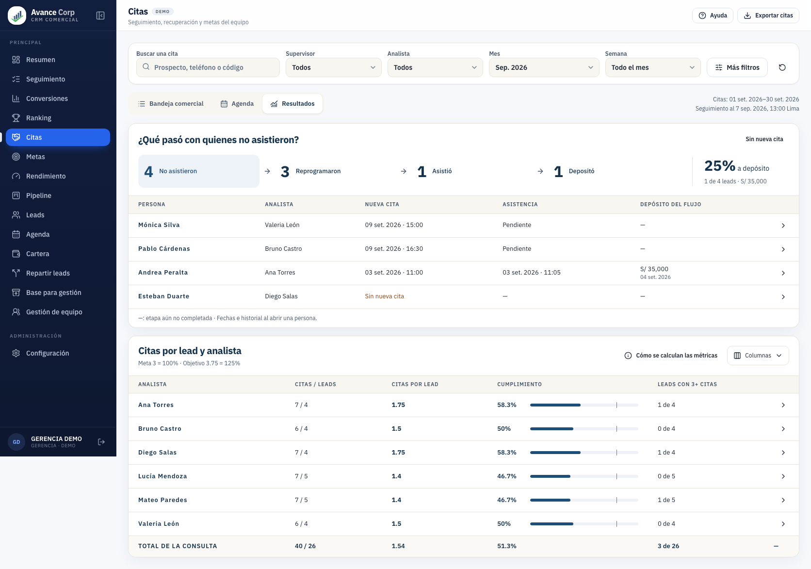

# Citas dentro de la identidad del CRM

2026-09-08. Miguel autorizó aplicar la recomendación de la [revisión visual y recursos Figma](../recursos-figma/README.md) y pidió ver el resultado en local. Esta adaptación reemplaza el aspecto rechazado de la propuesta 3. Sigue siendo un prototipo con datos ficticios; su aprobación visual final corresponde a Miguel.

[Abrir vista local](http://127.0.0.1:4180/prototypes/citas-crm.html).

## Qué cambió

- Se reutiliza el **Sidebar real** con una identidad estática de ejemplo. Mantiene marca, navegación, colapso, iconos y geometría. Los demás módulos llevan a la app local; no se inicia una sesión ni se conecta un servicio desde este prototipo.
- La cabecera sigue la altura y composición del CRM y presenta Ayuda y Exportar citas. No se monta el Topbar conectado al store; las acciones corresponden a esta consulta de ejemplo.
- Los paneles usan las clases y variables vigentes de Gerencia: fondo suave, blanco, bordes cálidos, títulos navy, IBM Plex Sans y pestañas agrupadas. Los recursos externos de Figma sirven como referencia; no se importa otro tema.
- Recuperación primero: etapas horizontales y tabla de personas dentro de un solo panel. Se elimina una cabecera intermedia repetida. Las filas vuelven a ser cómodas de leer.
- Las metas usan barras azules discretas: escala hasta 125%, marca de 100%, porcentaje explícito y leads con 3+ citas. El total se muestra una vez. La ficha vuelve al **Sheet modal del CRM**, sin reducir las tablas de fondo.

## Cómo probarlo

1. Elige mes, una de las cuatro semanas comerciales, supervisor o analista. Más filtros conserva estados, modalidad, origen, resultado, seguimiento, moneda e importe.
2. Pulsa Reprogramaron, Asistió o Depositó. Cambia la lista de personas sin alterar la base de recuperación ni las métricas de analistas. Sin nueva cita muestra a Esteban.
3. Abre Andrea: falta el 1 de septiembre, reprograma, asiste el 3 y deposita S/35,000 el 4. Escape cierra la ficha y devuelve el foco.
4. Compara promedio, cumplimiento y leads con 3+ citas. Columnas recupera supervisor, realizadas y leads con 2+ citas. La flecha abre los leads del analista; su nombre lleva a la bandeja filtrada.
5. Bandeja y Agenda conservan la consulta. Exportar incluye todas las coincidencias, también las de otras páginas.

Se conserva **4 → 3 → 1 → 1**, **25%=1/4**, **S/35,000**; equipo **40 citas / 26 leads**, promedio **1.54**, **51.3%** y **3 de 26** leads con tres o más citas. Meta **3=100%** y objetivo **3.75=125%**. No se agenda una cita extra a quien ya depositó para completar un contador.

Las semanas son 1–7, 8–14, 15–21 y 22–fin. Los filtros toman las citas de origen; el seguimiento puede salir de ese período hasta el corte visible. No se prorratea la meta entre semanas. El mes abreviado mantiene el año visible en ventanas estrechas.

## Evidencia y verificación

- [Escritorio](tablero.png), [pantalla completa](tablero-completo.png), [ficha de Andrea](ficha-andrea.png).
- [1024 px](ancho-1024.png), [768 px](ancho-768.png), [móvil](movil.png), [ficha móvil](movil-ficha.png).
- [Pruebas de navegador](interacciones.json), [script reproducible](verificar.mjs), [QA visual](../../../../CRM-Avance-Corp/app/design-qa.md).

PASS: gate integral `npm run check`; tras los ajustes finales, lint, TypeScript/build y las 31 pruebas del prototipo. Lint conserva cuatro advertencias previas de coverflow ajenas a este cambio. Navegador: consulta, etapas, ficha modal, Escape, citas vinculadas, columnas, estados vacíos, navegación por teclado, exportación y anchos 1672/1366/1280/1024/768/390. Se conserva desplazamiento horizontal dentro de las tablas en ventanas estrechas. En 1672×941, todo el documento mide 1173 px: el panel de analistas se completa desplazando verticalmente, con filas legibles.

NOT RUN: E2E completa del CRM productivo, backend y depósitos reales. La revisión de identidad no implica conectar las metas a la política productiva ni publicar.

Para reproducir, inicia Vite en 4180 desde `CRM-Avance-Corp/app` y ejecuta desde la raíz `node UX-UI-GERENCIA/propuesta-citas-crm-2026-09-08/experiencia/adaptacion-identidad/verificar.mjs`. El script usa Chromium aislado y no modifica citas reales.

Revisión de Claude recibida y evaluada por Codex: [registro y evaluación](revision.md). Se aplicaron los ajustes respaldados por evidencia y se descartaron las hipótesis resueltas por los componentes compartidos.
