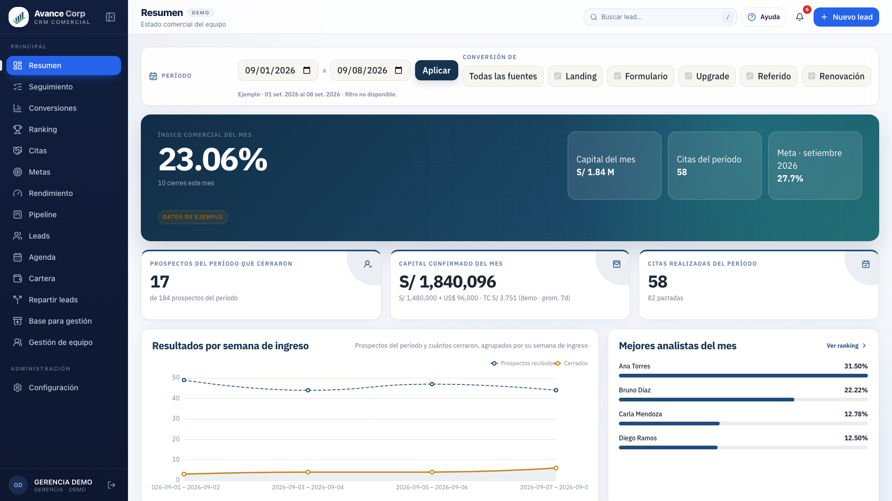
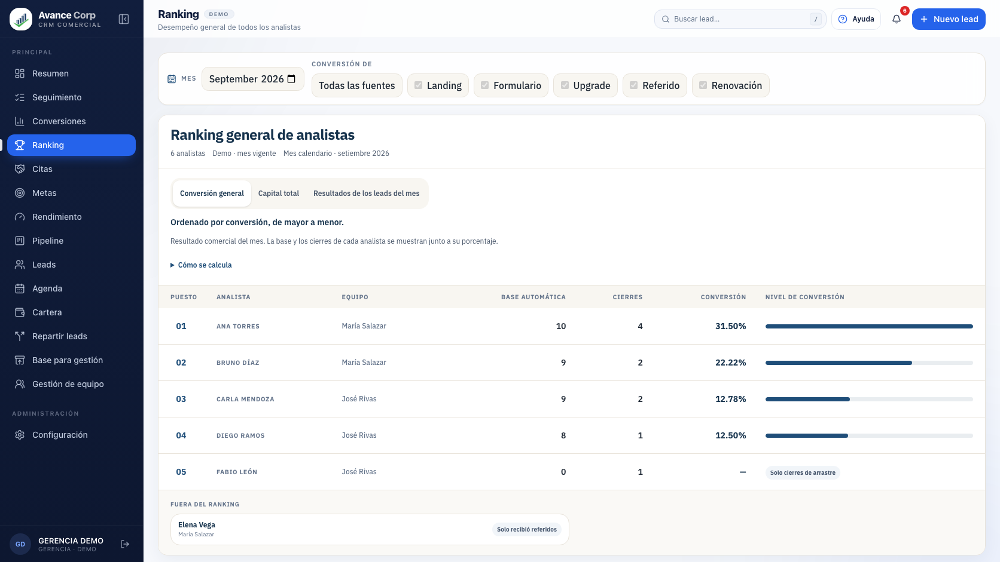
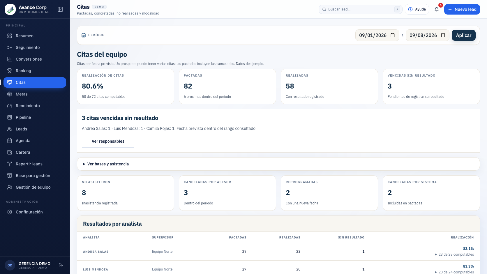
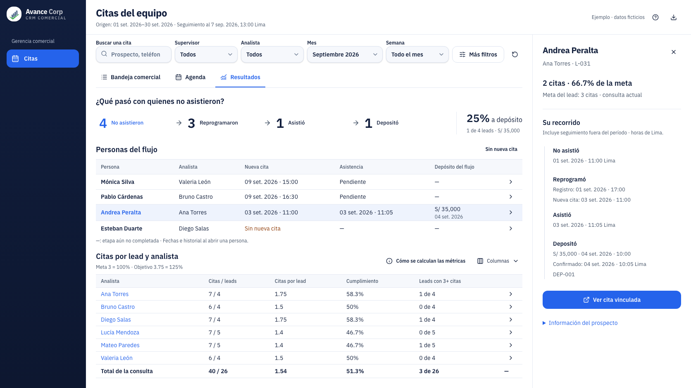
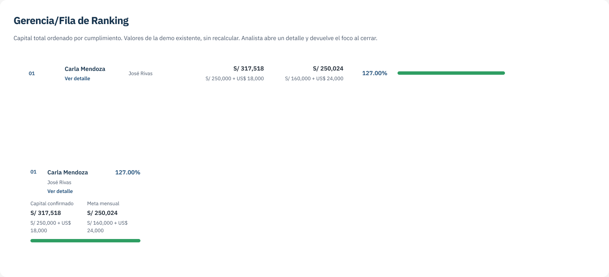
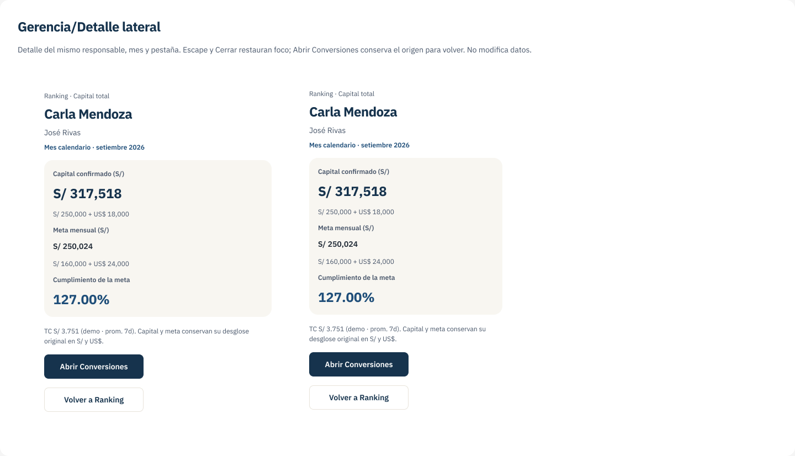

# Recursos Figma y corrección de dirección visual

2026-09-08. Miguel rechazó el aspecto de la implementación de la propuesta 3: no se parece a su CRM. Pidió buscar mejores recursos en Figma y una recomendación. Esta revisión conserva la lógica y documenta la dirección visual; no cambia el código del módulo ni publica diseños.

## Recomendación

Usar **Ranking y Metas del CRM como base visual**, con la navegación y cabecera reales, lienzo suave, paneles blancos redondeados, bordes cálidos, títulos navy, pestañas agrupadas y alturas de fila habituales. Mejorar la organización con recursos de Figma adaptados a esa identidad.

La siguiente composición de Citas debe mantener tres áreas: consulta compacta; un panel horizontal de recuperación con sus personas; comparación de analistas con promedio, cumplimiento y leads con 3+ citas. Fechas e historial en la ficha del CRM. Conservar 4 → 3 → 1 → 1, 25%=1/4, S/35,000 y meta 3=100% / promedio objetivo 3.75=125%. Reducir duplicación y texto repetido sin comprimir todas las filas ni quitar la separación visual entre áreas.

Antes de otro cambio de código, mostrar una composición editable en Figma situada dentro del marco real del CRM. Las imágenes de exploración y sus QA anteriores no equivalen a aprobación de identidad por Miguel.

## Recorrido capturado

Chromium aislado, demo local en `http://127.0.0.1:4180/`, 1672 × 941 CSS px, densidad 1, fuentes cargadas. Son capturas actuales del código local, no afirmaciones sobre el despliegue productivo. El prototipo se capturó a la misma medida en `/prototypes/citas-crm.html`.

1. **Resumen — identidad reconocible:** marco completo, paneles diferenciados y jerarquía de cifras. El bloque hero no se propone para Citas porque Miguel pidió ahorrar espacio.

   

2. **Ranking — base recomendada:** cabecera de panel, pestañas agrupadas, tabla con aire y barras discretas; tomar estos patrones para comparar metas por analista.

   

3. **Citas actual — conservar identidad, mejorar distribución:** paneles y cabeceras familiares; los KPI y bloques apilados explican el problema original de espacio. No volver a copiarlos todos.

   

4. **Propuesta 3 implementada — necesita corrección visual:** un lienzo blanco continuo, navegación reducida, pestañas subrayadas y filas muy densas se separan del resto del producto. La ficha visible reduce el espacio de lectura de las tablas.

   

## Hallazgos

| Prioridad | Evidencia | Cambio recomendado |
| --- | --- | --- |
| P1 · Consistencia del marco | Pasos 1–3 tienen menú completo de 240 px y cabecera global; paso 4 usa un rail distinto de 208 px y cabecera propia. | Componer dentro de Sidebar/Topbar reales y mantener su geometría. |
| P1 · Superficies y agrupación | Pasos 1–3 separan paneles sobre un fondo suave; paso 4 aplana todas las áreas sobre blanco. | Recuperar los contenedores de Gerencia, con dos paneles de información y consulta compacta. |
| P2 · Densidad | Ranking usa filas de lectura amplia; paso 4 reduce analistas a unos 30 px. | Alturas y jerarquía de tabla del CRM; ahorrar espacio quitando repeticiones y usando detalle contextual. |
| P2 · Pestañas | Ranking presenta control agrupado; paso 4 introduce un patrón de subrayado. | Usar el patrón de pestañas ya presente en el producto. |
| P2 · Ficha y recorrido | El detalle correcto no basta para que el inspector se perciba integrado. | Reutilizar cabecera, agrupación de datos y acciones de las fichas existentes; mostrar historial cuando se solicita. |

La tipografía del contenido de Gerencia ya usa IBM Plex Sans; la discrepancia principal está en composición, escala y espaciado. No resolverla cambiando arbitrariamente de familia tipográfica. La nota histórica de Fundamentos menciona Plus Jakarta; prevalecen las pantallas y el código vigentes.

## Recursos encontrados

| Recurso | Uso recomendado | Límite |
| --- | --- | --- |
| [Base del CRM en Figma](https://www.figma.com/design/1FEvjQkwSzNDsGJ7UUvqIK?node-id=2-2) | Cabecera, pestañas, período, fila de Ranking y detalle lateral. [Fila](https://www.figma.com/design/1FEvjQkwSzNDsGJ7UUvqIK?node-id=61-2) · [Detalle](https://www.figma.com/design/1FEvjQkwSzNDsGJ7UUvqIK?node-id=63-2). | Se inspeccionaron metadatos y renders. Son componentes locales/documentados; el archivo mezcla antecedentes y no debe asumirse sincronizado con la app. Por ejemplo, la referencia de Ranking en Figma conserva verde y el Ranking local actual usa azul. |
| [Obra shadcn/ui — Community](https://www.figma.com/community/file/1514746685758799870/obra-shadcn-ui) | Complementos para Data Table, Select/Combobox, Sheet y menús. Variables, estados y componentes editables para adaptarlos al CRM. | [El autor](https://shadcn.obra.studio/) ofrece Community gratuita y Pro de pago. [Catálogo consultado](https://shadcn.obra.studio/components). Usar partes concretas, sin adoptar su tema completo. |
| [Untitled UI — Filtros](https://www.untitledui.com/components/filters) | Referencia de barras compactas, filtros aplicados y panel de filtros avanzados. | Revisada la documentación pública del autor; no se importó una biblioteca ni se cambió el comportamiento de filtros actual. |
| [Untitled UI — Tablas](https://www.untitledui.com/components/tables) | Referencia de ordenación, selección, columnas y composición de tablas profesionales. | La página ofrece vista Figma y ejemplos. Su densidad no se copia literalmente: debe respetarse la del CRM. El MCP no permite inspeccionar el archivo externo sin acceso de edición; no se inspeccionaron sus capas. |

La búsqueda en las bibliotecas suscritas al Figma del proyecto no devolvió componentes para data table, filter o side panel. Sí se localizaron componentes propios al inspeccionar la página Base del CRM. No se concluye que el archivo tenga una biblioteca publicada y sincronizada solo por contener esos frames.

## Verificación y límites

PASS: consulta de Figma y fuentes públicas; apertura de las seis referencias; comparación de capturas a igual viewport; enlaces locales y `git diff --check` del alcance documental. El script inicial capturó un estado de carga de Citas; se descartó y se volvió a capturar tras aparecer su tabla. No se usa ese skeleton como evidencia de diseño.

NOT RUN: tests, build y nueva auditoría funcional completa. No hay cambios de código en esta revisión. No se midieron todos los contrastes ni se hizo un recorrido con lector de pantalla. Las filas compactas del prototipo merecen comprobarse con zoom y teclado al rediseñar, pero las capturas por sí solas no prueban un fallo de accesibilidad.

Pendiente: una nueva composición visual dentro de la identidad del CRM. No hay una nueva propuesta aprobada ni un nuevo módulo implementado.
