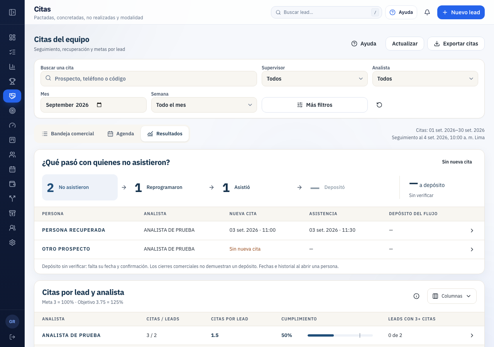

# Integración local de Citas en Gerencia

Miguel autorizó comenzar el desarrollo el 08/09/2026. El módulo ya se monta dentro del CRM, con su menú, cabecera, componentes, filtros y ficha real del prospecto. Esta entrega es local: la migración nueva no se ha aplicado al servidor remoto ni se ha publicado el frontend.

## Cómo verlo

Abre [el CRM local](http://127.0.0.1:4180/), entra en **Explorar en modo demo → Gerencia → Citas**. La demo usa las tareas y leads del store de demostración del CRM. El [prototipo anterior](http://127.0.0.1:4180/prototypes/citas-crm.html) conserva sus 40 citas ficticias y su ejemplo de depósitos; ambos comparten ahora los mismos componentes de presentación.

En una sesión real se consulta `crm.citas_gerencia_consulta_fn`. Mientras esa migración no esté aplicada al servidor de la sesión, se muestra «La consulta detallada de citas aún no está habilitada en este servidor», con Reintentar. No se reemplaza un fallo con datos demo.

Capturas con datos ficticios y transporte simulado: [inicio móvil](citas-mobile-inicio.png), [tabla móvil desplazable](citas-mobile.png). Las imágenes son capturas de la app real; no prueban que la migración esté publicada.

## Uso y definiciones

1. Mes y cuatro semanas comerciales: 1–7, 8–14, 15–21 y 22–fin, incluidos meses bisiestos. La consulta abre en Resultados. Supervisor, analista y búsqueda están a mano; Más filtros conserva estados, modalidad, origen, resultado, seguimiento, moneda e importe.
2. «¿Qué pasó con quienes no asistieron?» cuenta **leads únicos**. Pulsar una etapa filtra su lista de personas sin cambiar la base ni la consulta. Solo se siguen reprogramaciones vinculadas al mismo lead. La asistencia requiere el resultado de actividad asociado a la cita; su hora corresponde al registro del resultado.
3. «Citas por lead y analista» divide las citas filtradas entre sus leads distintos. Meta 3 = 100%; objetivo 3.75 = 125%. El total del equipo se calcula de nuevo con IDs únicos; no promedia promedios ni suma leads compartidos. Leads con 3+ citas muestra la distribución que el promedio puede ocultar. No se prorratea la meta por semana ni se mide la cartera sin citas; no se cambió la política productiva de metas mensuales.
4. Las citas de origen pertenecen al mes/semana seleccionado. Su seguimiento puede salir del período y llegar hasta el corte visible del servidor. Se incluye el historial activo de esos leads, pero sus otras citas no se suman a la consulta del período.
5. Abrir una persona muestra el recorrido; abrir una cita permite consultar su ficha y entrar a la ficha real del prospecto. Bandeja y Agenda mantienen los filtros. Exportar descarga todas las citas coincidentes, incluidas las de otras páginas, con protección de fórmulas en CSV.

**Depósitos pendientes de definición:** los registros revisados no aportan una fecha de depósito y una confirmación bancaria identificables. La API devuelve `disponibilidad_depositos: sin_registro`; el módulo muestra **— / Sin verificar**, nunca 0 ni un cierre comercial convertido en depósito. Se preguntó a Miguel dónde registran el abono y quién lo confirma. Esa respuesta y su integración siguen pendientes. La cadena de depósitos confirmados del prototipo está preparada, pero no se atribuye a datos reales.

Los responsables son los registrados en la cita, no necesariamente quienes la crearon. El supervisor se resuelve con la pertenencia disponible, sin afirmar que sea una foto histórica del equipo. Citas postventa se cuentan aparte y remiten a Agenda; no entran en citas por lead.

## Implementación

- `app/src/components/citas/`: componentes compartidos, contexto obligatorio y cálculos puros sin fixtures implícitos. Conserva estilos y componentes del CRM.
- `app/src/data/citas-gerencia.ts`: frontera validada, período y IDs comprobados, consulta cancelable y caché por actor/mes. No conserva filas de otro mes como datos de la consulta nueva.
- `app/src/screens/hoy/citas-gerencia.tsx`: conexión a sesión, datos y apertura de lead. `screens/gerencia.tsx` monta el módulo para Gerencia; otros roles conservan su pantalla anterior.
- `supabase/migrations/20260909003243_crm_citas_gerencia_consulta_detallada.sql`: lectura nueva, núcleo privado con `search_path` vacío y autorización mediante `private.rol_crm`. Sin nuevos escritores ni modificaciones de objetos `public`.
- `supabase/scripts/test-citas-gerencia-consulta.sql`: banco transaccional local, datos ficticios y rollback; rechaza cualquier nombre de base diferente del banco aislado.
- `database.types.ts`: se incorporó solo la firma de la RPC generada por Supabase CLI contra la base local. Una generación contra producción todavía no puede incluirla.

El cierre posterior usa la misma evidencia canónica de `conversion_episodios`: resultado convertido de `lead_asignaciones`, fecha del resultado y exclusión de cierres anulados. La lectura se limita a los leads de la consulta y evita calcular índices/ponderaciones ajenos. Incluye cierres anteriores al mes cuando son posteriores a una cita histórica. Esto solo informa seguimiento comercial, no confirma dinero.

Límite explícito: hasta 10.000 citas de historial. La fila 10.001 produce error de capacidad; nunca se entregan subtotales como si fueran la consulta completa. Si se alcanza este límite habrá que añadir paginación de servidor.

## Evidencia y verificación

| Comprobación | Resultado |
| --- | --- |
| `npm run check` | PASS: lint, TypeScript, 220 archivos / **3.130 pruebas**, cobertura, release config, build, bundle y duplicación. Cuatro advertencias previas de coverflow. |
| `npm run build`, tras ajuste móvil final | PASS. |
| Citas y gráficas, Playwright aislado | PASS: **7 pruebas**. Mes/semana entre vistas, ayuda/Escape/foco, vacío, fallo de RPC y recuperación, ausencia de cifras demo, recorrido, metas y capturas 1280/390. |
| Banco SQL nuevo | PASS: Gerencia activa; rechaza analista, supervisor, Directorio, portal inactivo, equipo inactivo, combinación portal-Directorio/CRM-Gerencia y ausencia de identidad; anon sin EXECUTE. Cohorte, vínculo entre leads, asistencia asociada, cierre previo al mes, postventa al corte, ISO y límites 10.000/10.001. |
| `check:scripts` y `test:edge-preflight` | PASS. |
| `seed:preflight`, `test:rls:preflight` | **NOT RUN**: falta `SUPABASE_URL` en el entorno de esos scripts. La matriz SQL anterior sí se ejecutó. |
| Suite E2E completa | **FAIL**: ejecución inicial 136 PASS / 26 SKIP / 3 FAIL. Se actualizó la aserción de Citas sustituida por este diseño y su suite pasa. Quedan dos fallos ajenos, detallados abajo; no se repitió la suite completa para declararla verde. |
| Publicación, migración remota y depósitos reales | **NOT RUN**. |

Fallos ajenos: `e2e/cliente-form.spec.ts:123` espera el correo disabled, mientras el cambio previo de ClienteForm lo presenta readonly; `e2e/distribucion-gerencia.spec.ts:68` busca Guardar en un flujo modificado previamente que introduce revisión del límite. Sus fuentes ya estaban modificadas antes de esta tarea. No se alteraron para obtener un gate verde.

El banco `citas_integracion_20260908` se creó dentro del contenedor local de CRM con esquema **sin datos de personas**, tomado de `avancecorp-f4-reconstruccion`. La restauración encontró incompatibilidades de cron/ACL de extensiones entre instancias; las tablas y funciones CRM pertinentes sí se restauraron y ejecutaron. No es evidencia de un replay limpio de todas las migraciones ni de paridad integral con producción.

El censo remoto fue solo de lectura y devolvió conteos, sin identidades: 152 citas activas de leads; 55 no-show; 27 no-show con sucesora del mismo lead; 0 con sucesoras múltiples en competencia; 0 completadas sin actividad de resultado asociada. No demuestra que todos los registros históricos tengan evidencia bancaria.

La revisión de Claude se recibió con `CHANGES_REQUESTED` y Codex evaluó sus hallazgos: [revisión](review-claude.md), [decisiones y pruebas](evaluacion-codex.md). No se interpreta como aprobación de publicación ni aprobación visual del cliente.

Logs: [gate frontend](check.log), [build final](build.log), [E2E Citas](e2e-citas.log), [E2E completa inicial](e2e-completa.log), [SQL local](sql.log).

## QA visual

Se inspeccionaron las capturas reales de 1280×900 y 390×844. Se conserva el marco del CRM, sus paneles, tipografía, tablas y acciones. El menú colapsado se expande al pasar el puntero; las capturas finales retiran el puntero para no tapar contenido. El flujo es horizontal en escritorio y se acomoda en dos filas en móvil; las tablas tienen desplazamiento propio y navegación con flechas. El contenido largo necesita desplazamiento vertical dentro de la app.

Se detectó Exportar recortado a 390 px: las acciones ahora envuelven a otra línea. El E2E comprueba que su borde queda dentro del viewport y la captura final se inspeccionó. No se hizo una auditoría exhaustiva con lector de pantalla ni una nueva aprobación visual de Miguel.

## Siguiente entrega

Definir con Miguel la fuente/confirmación del depósito y conectarla sin perder las condiciones temporales ni duplicar personas. Después, ensayar la migración en el entorno remoto autorizado, validar con una sesión real y publicar solo mediante el procedimiento vigente de `avancecorp/main`. Esta tarea no ejecuta esa publicación.
