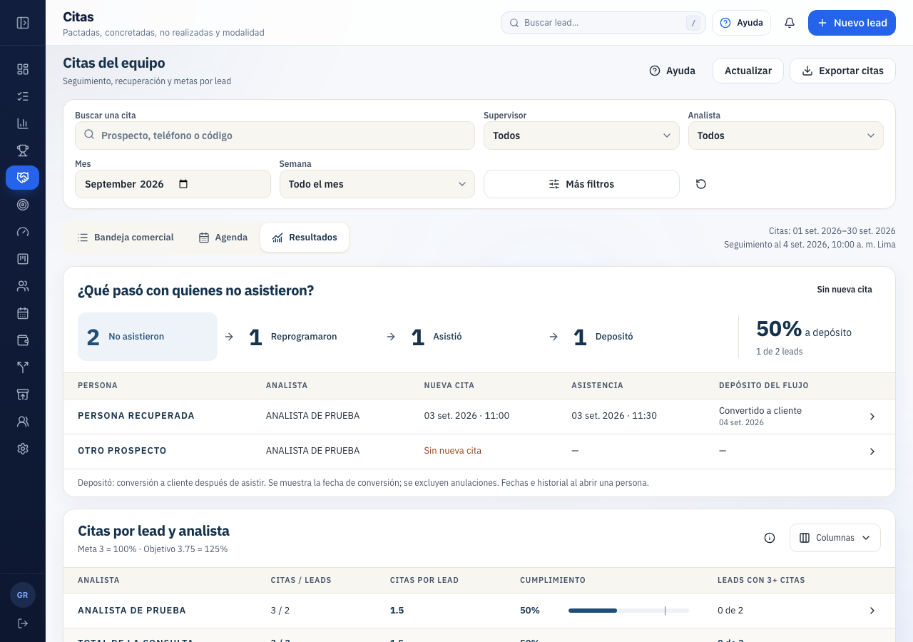

# Depositó: conversión a cliente

Miguel aclaró la regla: **«se sabe que alguien depositó cuando se le convierte en cliente»**. Queda resuelta la definición pendiente de la integración inicial. El indicador se conectó en código y se ensayó localmente; la migración sigue sin publicarse en remoto.

## Fuente identificada

Se comprobó la definición vigente de `crm.convertir_lead(uuid,uuid)` mediante una lectura del servidor. Valida que el destino tenga rol cliente y, en un mismo UPDATE, escribe `crm.leads.etapa = convertido`, `perfil_id` y `convertido_en = now()`. También registra la actividad «Convertido a cliente». El navegador llega a esa operación mediante `convertirLead` → Edge `crm-convertir-lead`.

La nueva lectura devuelve conversiones de los leads de la consulta con etapa convertido, perfil vinculado de rol cliente, fecha no posterior al corte y sin anulación según `private.cierre_anulado`. Una conversión se cuenta una vez aunque el lead tenga varias citas. Inactivar el acceso del cliente no elimina un hecho comercial; la exclusión la determina la anulación del cierre. Los cierres externos sin cliente vinculado no se equiparan automáticamente a esta definición.

La columna y la ficha muestran **Convertido a cliente** y **Fecha de conversión**. Esa fecha corresponde al evento del CRM; no se presenta como hora de una transferencia bancaria. No se usa monto_estimado para mostrar dinero depositado. Las conversiones aportan al conteo y al porcentaje, sin importe monetario inventado.

## Regla del recorrido

Se conserva la secuencia acordada: no-show → reprogramación explícita del mismo lead → asistencia registrada → conversión a cliente posterior a la asistencia. El último conjunto es parte del anterior; no puede haber dos depositantes en este recorrido si solo uno asistió. Una conversión anterior a esa asistencia no completa la última etapa de **este flujo**. No significa que el lead no haya depositado: significa que no recorrió esa secuencia.

Los filtros eligen las citas de origen y las conversiones se siguen hasta el corte, incluso fuera del mes/semana. Cada lead cuenta una vez. El total de la prueba es 2 → 1 → 1 → 1, conversión 50%=1/2, sin importe al lado del indicador.

[Móvil](citas-mobile-inicio.png). Son capturas de la app con respuestas simuladas de la nueva RPC, no evidencia de publicación. La demo general del CRM todavía no modela el vínculo del lead al cliente; conserva fuente no disponible, en lugar de inventar IDs o mostrar cero. El prototipo anterior conserva su ejemplo de movimientos monetarios.

## Cambios y verificación

- Nueva migración `20260909015744_crm_citas_deposito_por_conversion_cliente.sql`. No se modificó la migración ya versionada. Mantiene la misma autorización Gerencia/ACL y el límite 10.000 del lector.
- Contrato JSON V2 con `conversiones`. Frontend acepta también V1: se mantiene disponible el resto de Citas, con depósitos sin verificar cuando la nueva fuente no está instalada.
- Modelo de evidencia distingue movimiento monetario de conversión a cliente. Una conversión no necesita un monto ficticio para contar; UI y pruebas confirman que no se renderiza S/0 ni el monto estimado como depósito.
- Tipos regenerados mediante Supabase CLI local: firma de la RPC idéntica, retorno Json. El nuevo contenido se valida explícitamente mediante el esquema V2.

PASS: `npm run check`, **222 archivos / 3.150 pruebas**, build, TypeScript, lint (cuatro advertencias preexistentes de coverflow), cobertura, bundle y duplicación. PASS: **7 E2E** de Citas/gráficas; incluyen filtro Depositó, ficha con fecha de conversión, ausencia de importe inferido y conservación de la base.

PASS: matriz SQL de permisos, cohorte y volumen de Citas, más `test-citas-deposito-conversion.sql`: conversión vigente, varias citas del mismo lead, anulación, perfil sin cliente, perfil de otro rol, acceso del cliente inactivo, etapa abierta, conversión futura, lead fuera de cohorte y lead inactivo. Todos los datos ficticios se revierten por rollback en el banco `citas_integracion_20260908`.

La última corrección SQL, después de la revisión, comprobó rol cliente y unificó el uso del helper de anulación. Se repitió la matriz SQL y pasó. No cambió el frontend después de sus gates.

Claude revisó el cambio como SECONDARY_REVIEWER: [revisión](review-claude.md), [evaluación de Codex](evaluacion-codex.md). Logs: [frontend](check.log), [E2E](e2e.log), [SQL](sql.log). Las capturas se inspeccionaron en escritorio y móvil; se conserva el diseño anterior.

NOT RUN: aplicación remota, sesión real contra la nueva migración y publicación. La suite E2E general no se repitió: los dos fallos ajenos documentados en [la integración inicial](../README.md) siguen pendientes. Tampoco se repitieron los preflights generales de seed/RLS sin credenciales; la matriz SQL de esta lectura sí se ejecutó. No se realizaron transferencias ni escrituras remotas.

El censo remoto solo de lectura encontró **0 leads activos convertidos con cliente vinculado entre quienes tienen no-show** en la foto consultada. No se usa la demostración positiva para afirmar un depósito real.

Para publicar: el frontend V2 es compatible con la respuesta V1; desplegar primero un bundle compatible o coordinar ambos cambios. Un bundle intermedio que solo admita V1 rechazaría el nuevo JSON V2. El servidor productivo actual todavía no consume esta RPC desde este módulo nuevo. Se mantiene el procedimiento de publicación vigente de avancecorp/main.
